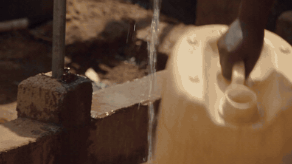

# 001 — Nairobi, 1980s. A plot in Jericho estate.



**Watch:** [the 25-second cut](media/nairobi-1980s-plot-v3-25s.mp4) (the one that went around) · [the full 55-second story](media/nairobi-1980s-plot-full-story-55s.mp4) (morning to lamp-light)

| | |
|---|---|
| Video model | Seedance 2.5 (ByteDance) via fal — text-to-video for the first clip, reference-to-video for the continuation |
| Music | Suno v5.5, Benga style prompt, instrumental |
| Post | ffmpeg + librosa — [`pipeline/align_and_mix.py`](../../pipeline/align_and_mix.py) |
| Format | 16:9, 720p, 24 fps |
| Prompts | [01 original](prompts/01-seedance-original.md) · [02 fixed](prompts/02-seedance-v3-recommended.md) · [03 continuation](prompts/03-seedance-continuation.md) · [04 Suno](prompts/04-suno-benga.md) |

## The story

A day in a plot — a compound of rented rooms around a shared dirt courtyard, common in Nairobi's Eastlands estates. Someone in the family has a camcorder and points it at whatever is happening.

It starts in the morning: smoke off a mabati roof. A young man leans on the family's navy Peugeot 504 — the son. The women are at the tap with jerry cans, laundry going up on the lines, kids tearing across the courtyard. The camera walks out the gate into the lane: a plastic-bag football, mama mboga's stall, a bicycle upside-down on its saddle, a bus through the dust, a goat, a radio on a windowsill. Then the light goes orange, the jikos come out, and an older man is sitting in the Peugeot now — the father, done for the day. The woman at the green window is still there. Kids get called in. Someone lights a paraffin lamp. Tape off.

None of that story was planned in advance. The first clip was one prompt. The continuation was a second prompt written *around what the first one gave me* — the Peugeot, the window, the kids — which is the way I now think this format works: generate, look at what you got, write the next chapter from that.

## What was made, in order

**Generation 1** — [prompt 01](prompts/01-seedance-original.md), 30 seconds. Nailed the world. Gave one woman three hands at the water tap.

**Edit 1** — removed the whole tap shot (7.7 s → 11.9 s). Because the video is cut every ~2 seconds anyway, the splice reads as just another cut. Re-encoded once at CRF 17. This is the 25-second version.

```bash
ffmpeg -i original.mp4 -filter_complex \
"[0:v]trim=0:7.70833,setpts=PTS-STARTPTS[v1];[0:v]trim=11.875,setpts=PTS-STARTPTS[v2];[v1][v2]concat=n=2:v=1:a=0[v];\
 [0:a]atrim=0:7.70833,asetpts=PTS-STARTPTS[a1];[0:a]atrim=11.875,asetpts=PTS-STARTPTS[a2];[a1][a2]concat=n=2:v=0:a=1[a]" \
-map "[v]" -map "[a]" -c:v libx264 -crf 17 -preset slow -c:a aac trimmed.mp4
```

**Music + mix** — Suno track ([prompt 04](prompts/04-suno-benga.md)), then `align_and_mix.py`. Best slice of the song started at 11.03 s; the cuts land within 86 ms of a beat on average. Music ducks under voices and the kids screaming, swells back in the gaps.

**Generation 2** — [prompt 03](prompts/03-seedance-continuation.md), reference-to-video, 30 seconds. Followed all three acts first try.

**Edit 2** — trimmed one second where the plastic-bag ball was a frisbee; low-passed two windows of audio where a rooster crowed at dusk. Joined to the 25-second cut. Re-aligned the music across all 29 cuts (97 ms mean — still on the right side of "on beat"). Music eases from 0.85 down to 0.6 through the evening act so the Benga is a party in the afternoon and a radio somewhere by dusk, then fades out on the lamp. That's the 55-second version.

## Lessons

**Translate the culture, not the words.** The prompt started life as "a trailer park in Alabama." There is no trailer park in Kenya. But there is a *plot* — same closeness, same everyone-outside, same everybody-knows-your-business — and the moment I swapped the social structure instead of the vocabulary, the footage stopped looking like a stock photo of Africa.

**Say the language, and say the region.** "African" audio defaults to a West African blend. I never wrote the word Swahili in the first prompt and it showed. Then I wrote it in the second prompt and every single person started narrating their chores. The fix is to describe how *rare* speech is and what the soundscape is *instead* — wind on the mic, jerry cans, footsteps. Models fill silence with whatever you name.

**Hands get their own sentence.** Any action that's mostly hands — a tap, a clothes peg — gets "exactly two hands, done simply and naturally" in the prompt. It's not elegant. It works.

**Don't fix the shot, cut it.** Three hands are un-fixable and they're the first thing a commenter screenshots. Fast-cut footage forgives a missing shot completely; it does not forgive an extra limb.

**Move the music, not the picture.** I never re-cut video to fit the song. The script slides the song under the cuts and finds where the beats already land. Under ~100 ms and the eye reads it as intentional.

**Ducking is the difference between a slideshow and a film.** Music sitting on top at one level *feels* like AI. Music that gets out of the way when a kid screams and comes back when they stop feels like someone mixed it.

**Look at the whole clip before you write the next prompt.** I wrote "a white car" into the continuation from a glance at one frame. It was a navy Peugeot. A one-frame-per-second contact sheet caught it. If the anchor is wrong, the model concludes the reference doesn't match and drifts on everything.

**The likeness filter doesn't know your faces are fake.** fal's reference mode refused my own generated clip. Feed it a face-free cut (roofs, the car, the tap) and put the people in the text by their clothes.

**The best moment was an accident.** A man notices the camera and looks away. Nobody prompted that. When a model does something that good, write it down and ask for it by name next time — I did, and the continuation gave the same man a nod at the lens.

**A rooster at dusk is a mistake even though it isn't.** Real roosters crow all day. On a soundtrack, a crow means morning. Sound cues are about what the audience *believes*, not what's true.
